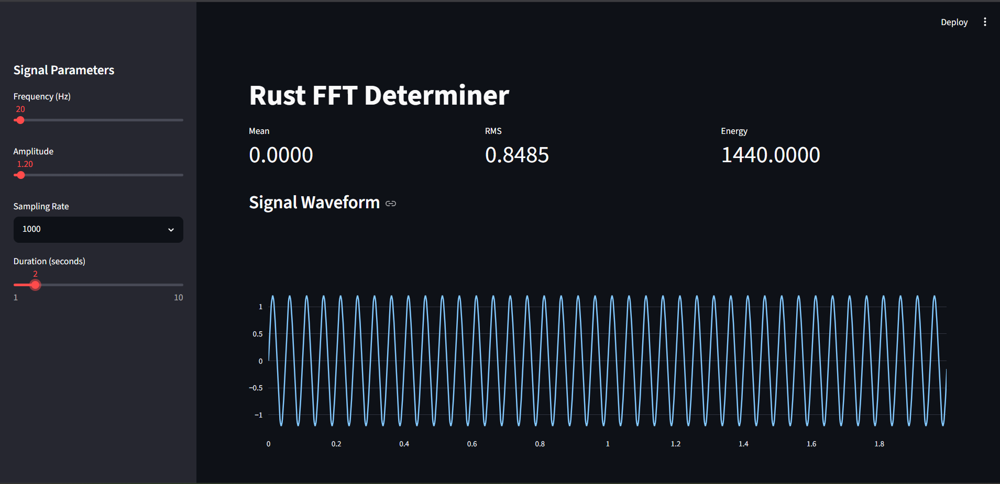
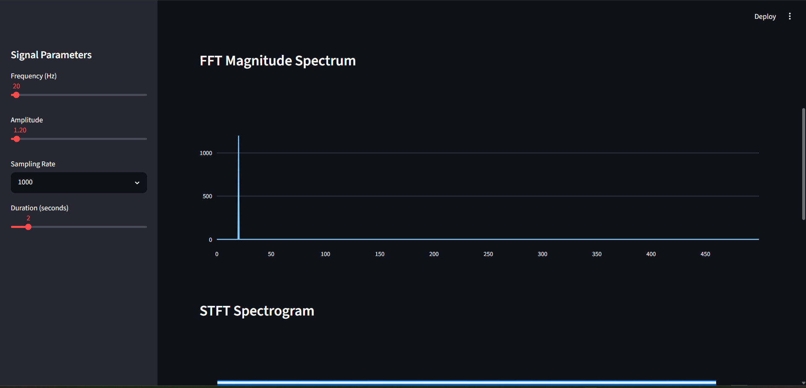
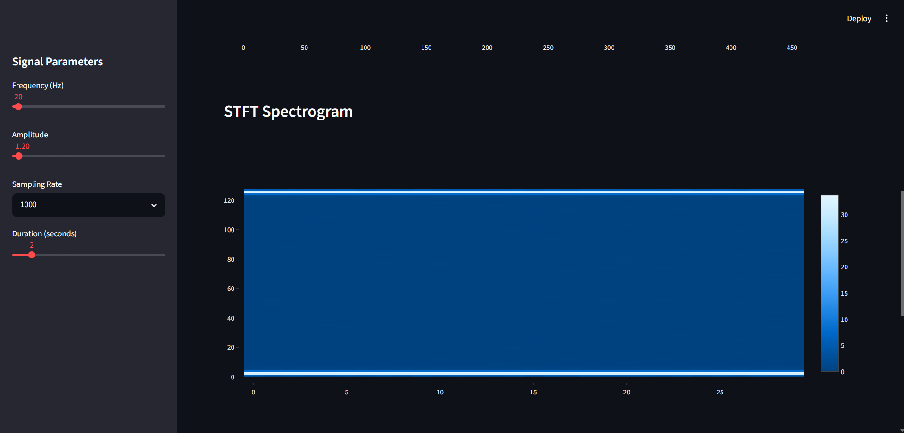
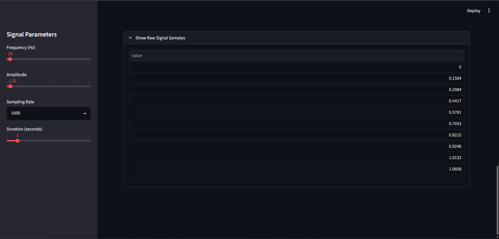

# Rust FFT Determiner

High-performance Digital Signal Processing toolkit built in Rust with PyO3 bindings and an interactive Streamlit frontend.

A Digital Signal Processing toolkit built with:

- Rust
- PyO3
- Python
- Streamlit

## Features

- FFT
- STFT
- Window Functions
- Filters
- Statistics
- Signal Utilities

## Run

```bash
maturin develop
streamlit run frontend/app.py
```

## Screenshots

### Dashboard



### FFT Spectrum



### STFT Spectrogram



### Raw Signal Samples


